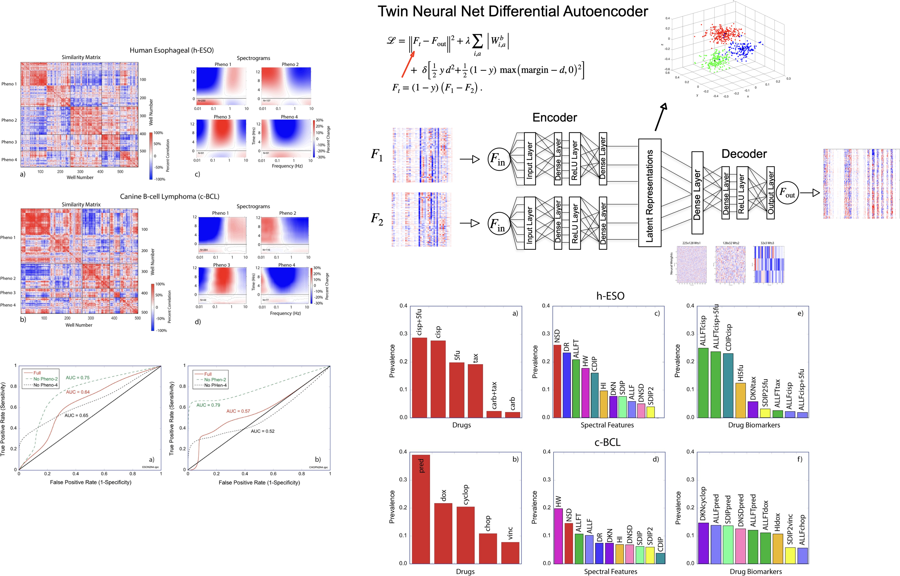
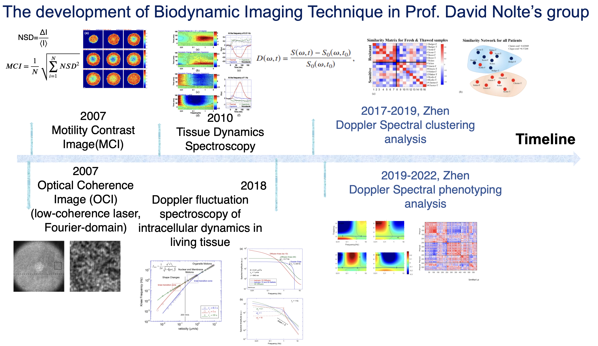
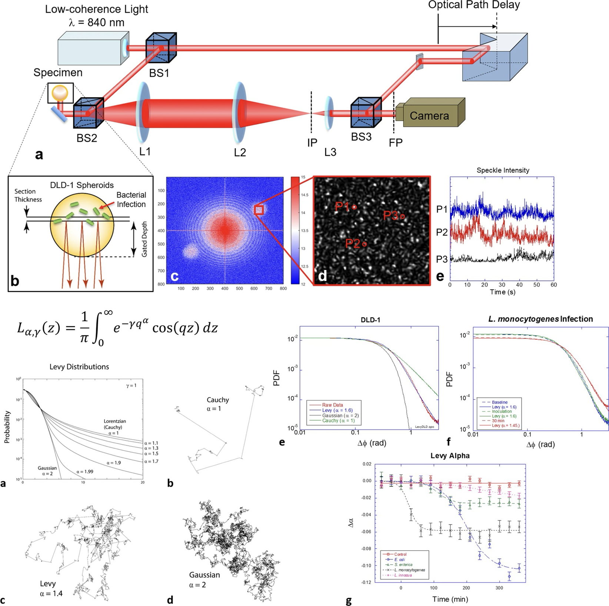
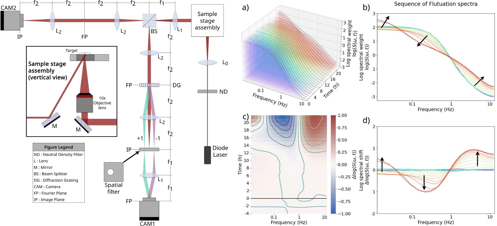
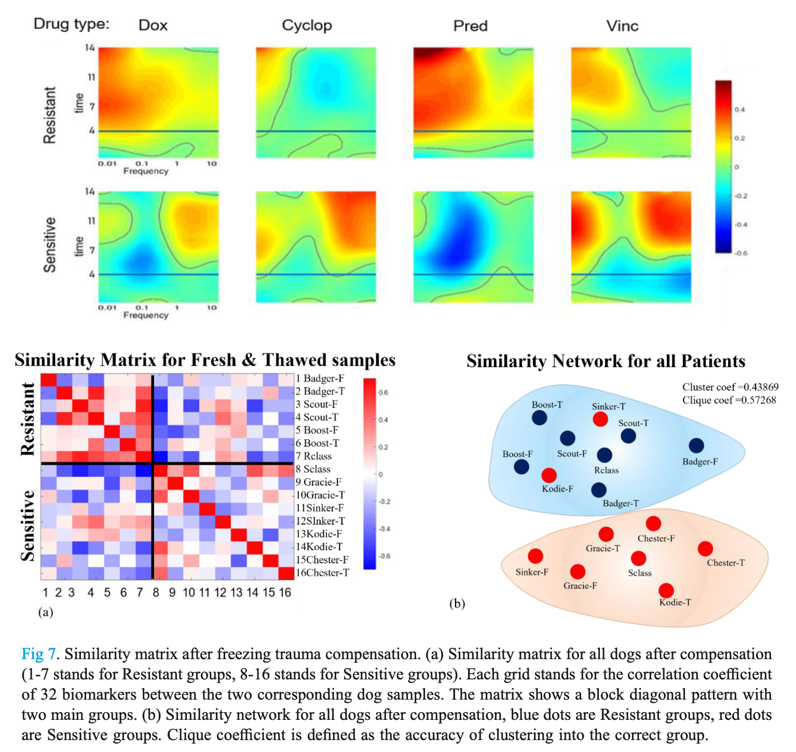

 <a href="mailto:huazhensdu@gmail.com">Email</a> | 
<a href="https://www.linkedin.com/in/zhenhua23" target="_blank">LinkedIn</a>

---

## About me

I’ve been a postdoctoral fellow in Johnny Tam’s Lab at <a href="https://www.nei.nih.gov/research/research-labs-and-branches/clinical-and-translational-imaging-section" target="_blank">National Eye Institute (NIH)</a>,starting from June 2023, applying adaptive-optics techniques to advance quantitative vision science.

I have 8+ years of experience of integrating signal processing, physics-based simulation, and deep learning to probe complex biological systems—from intracellular dynamics in living tissue to high-resolution structural imaging. My research focuses on developing streamlined Python pipelines that extract interpretable biomarkers to drive both scientific discovery and clinical translation.

---

## Publications and Work in Progress

<table>
  <tr>
    <td></td>
    <td class="project-text">
      <strong>Quantitative Analysis of the Choriocapillaris Meshwork using AO-ICG</strong> 
      Zhen Hua, ARVO, 2025 
      <a href="projects.html" target="_blank">Read more</a> |
     <a href="https://github.com/NIH-NEI" target="_blank">Github</a>
    </td>
  </tr>
  <tr>
    <td></td>
    <td class="project-text">
      <strong>Comparative Cancer Chemosensitivity Phenotypes using Low-Coherence Digital Holography</strong> 
      Zhen Hua et al., Scientific Reports, 2024 
      <a href="assets/papers/Scientific_Reports_2024.pdf" target="_blank">Paper</a> |
     <a href="https://github.itap.purdue.edu/Nolte-Group/onekey" target="_blank">Github</a> |
     <a href="https://www.eurekalert.org/news-releases/1034345" target="_blank">EurekAlert! News</a> 
    </td>
  </tr>

  <tr>
    <td></td>
    <td class="project-text">
      <strong>Development of Biodynamic Imaging for Phenotypic Profiling of Living Tissue</strong> 
      Zhen Hua, Ph.D. Thesis, Purdue University 
      <a href="assets/papers/Thesis_ZhenHua.pdf" target="_blank">Thesis</a> |
     <a href="https://github.itap.purdue.edu/Nolte-Group/onekey" target="_blank">Github</a>
    </td>
  </tr>

  <tr>
    <td></td>
    <td class="project-text">
      <strong>Doppler Imaging Detects Bacterial Infection of Living Tissue</strong> 
      Honggu Choi, Zhen Hua et al., Communications Biology, 2021 
      <a href="assets/papers/Communications_Biology_2021.pdf" target="_blank">Paper</a> |
     <a href="https://phys.org/news/2021-02-scientists-doppler-peer-cells.html" target="_blank">Phys.org News</a>
    </td>
  </tr>

  <tr>
    <td></td>
    <td class="project-text">
      <strong>Intracellular doppler spectroscopy of live tissue sentinels for a fast in-vitro bacterial infection assay</strong> 
      Dawith Lim, Zhen Hua et al., Scientific Reports, 2025 
      <a href="assets/papers/scientific_reports_2025.pdf" target="_blank">Paper</a>
    </td>
  </tr>

  <tr>
    <td></td>
    <td class="project-text">
      <strong>Chemosensitivity Testing of Revived Snap-Frozen Biopsies using Digital Speckle Holography</strong> 
      Zhen Hua, Asian Journal of Physics, 2022 
      <a href="assets/papers/Asian_Journal_of_Physics_2022.pdf" target="_blank">Paper</a>
    </td>
  </tr>
  

</table>

---

## Conference Proceedings and Invited Talks

- Zhen Hua et al. *Characterizing Adaptive Optics Choriocapillaris Images Using Feature Engineering*. **ARVO Imaging in the Eye Conference**, <a href="https://iovs.arvojournals.org/article.aspx?articleid=2810554" target="_blank">2025</a>
- Sierra M. Hyland, Zhen Hua et al. *Structural assessment of cone photoreceptors near flecks in Stargardt disease using adaptive optics*. **ARVO Annual Meeting**, <a href="https://iovs.arvojournals.org/article.aspx?articleid=2808608" target="_blank">2025</a>
- Zhen Hua et al. *Quantitative Analysis of the Choriocapillaris Meshwork in Healthy and Diseased Eyes using AO-ICGA*. **ARVO Annual Meeting**, <a href="https://iovs.arvojournals.org/article.aspx?articleid=2798073" target="_blank">2024</a>
- Dawith Lim, Zhen Hua et al. *Observing Cross-Species Cross-Cancer Chemosensitivity Signatures with Dynamic-Contrast OCT*. **SPIE BiOS (OCT and Coherence Domain Imaging XXVIII)**, [2024](https://doi.org/10.1117/12.3002602)
- Dawith Lim, Zhen Hua et al. *Doppler Spectroscopy of Intracellular Dynamics Detects Pathogenic Infection and Antibiotic Resistance*. **CLEO Conference**, [2024](https://opg.optica.org/abstract.cfm?uri=CLEO_AT-2024-ATh3B.4)
- Zhen Hua et al. *Classifying Tumor Heterogeneity of Human Esophageal Cancer Biopsies by Dynamic Contrast OCT with Deep Learning*. **SPIE Photonics West**, [2023](https://doi.org/10.1117/12.2647602)
- David Nolte, Zhen Hua et al. *Coherence-Gated Digital Holography for Personalized Cancer Care*. **OSA Digital Holography and 3D Imaging**, [2023](https://doi.org/10.1364/DH.2023.HM1C.2)
- Zhen Hua et al. *Biodynamic Monitoring of Bacterial invasion of Living Tissue*. **American Physical Society (APS) March Meeting**, [2023](https://ui.adsabs.harvard.edu/abs/2023APS..MARN06009H/abstract) 
- Zhen Hua et al. *Phenotyping Drug Response of Living Tissue based on Tissue-Dynamics Spectroscopy*. **SPIE Photonics West**, [2022](https://doi.org/10.1117/12.2610371)
- Zhen Hua et al. *Doppler Spectroscopy of Intracellular Dynamics During Chemotherapy in Tumor Biopsies*. **American Physical Society (APS) March Meeting**, [2020](https://meetings.aps.org/Meeting/MAR20/Session/B06.7)
- Zhen Hua et al. *Doppler Spectroscopy of Intracellular Motion in Revived Flash-Frozen Cancer Tissues*. **American Physical Society (APS) March Meeting**, [2019](https://ui.adsabs.harvard.edu/abs/2019APS..MARR64004H/abstract)
